<div align="center">

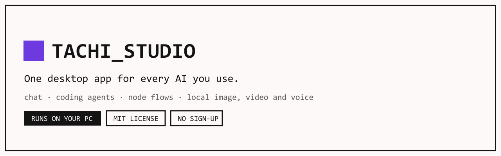

**One desktop app for every AI you use — and it runs on your own machine.**

Chat with any model, run coding agents on your own repos, wire multi-step flows
on a canvas, and generate images, video and speech locally. No sign-up, no
subscription, and no server of ours between you and the model.

[](https://github.com/tachikomared/tachi-studio/actions/workflows/ci.yml)
[](https://github.com/tachikomared/tachi-studio/releases/latest)
[](https://github.com/tachikomared/tachi-studio/releases)
[](LICENSE)
[](https://github.com/tachikomared/tachi-studio/releases/latest)

### [⬇ Download for Windows](https://github.com/tachikomared/tachi-studio/releases/latest)

Installer or portable folder · no admin rights · nothing phones home

</div>

---

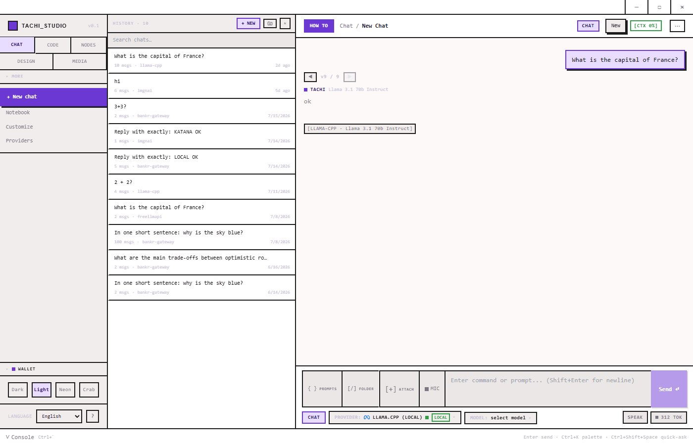

## Why this exists

Every AI tool wants its own tab, its own subscription and its own copy of your
data. Tachi Studio puts them in one window that belongs to you: your keys stay
in your operating system's keychain, your chats stay in a file on your disk, and
anything that can run locally does. You can pull the network cable out and the
app still works — just with fewer models.

It is a real desktop program, not a browser wrapper around someone's API.

## What you get

|  |  |
|---|---|
| 💬 **Chat with anything** | Anthropic, OpenRouter, Ollama, llama.cpp, and a built-in free router that spreads requests across 17 keyless providers. Add any OpenAI-compatible endpoint you run yourself. |
| 🧠 **It picks the model for you** | Leave the model on `AUTO`. A local classifier reads the prompt in under a millisecond and sends "what's 2+2" somewhere cheap and "rewrite this service" somewhere strong. You keep the dial if you want it. |
| 🤖 **Coding agents on your repo** | Point an agent at a folder and it reads, edits, runs commands and reports back — with a permission prompt before anything touches disk or network. |
| 🕸 **Flows on a canvas** | Drag providers, prompts, agents and tools onto a board, connect them, hit run. Save it, share it as a file, or run it on a schedule. |
| 🎨 **Local image, video and voice** | Stable Diffusion, video, text-to-speech and speech-to-text run on your GPU. The engines download on request, are checked against the publisher's own hash, and then work with the network off. No credits, no queue, no upload. |
| 🔒 **A private mode that means it** | One switch disables every cloud provider, web search and non-local tool at the process boundary — not with a checkbox the UI politely respects. |
| 🔌 **Talks to your other tools** | Serves an OpenAI-compatible API on `127.0.0.1`, so Claude Code, Cursor or any OpenAI SDK can use this app as their backend. Also runs an MCP server, and installs MCP servers from a catalog. |
| 🌍 **8 languages** | English, Russian, Spanish, French, German, Chinese, Japanese, Korean. |

---

## Install

### Windows

**[Download the latest release →](https://github.com/tachikomared/tachi-studio/releases/latest)**

| File | What it is |
|---|---|
| `Tachi-Studio-Setup-<version>.exe` | Normal installer. Per-user, so Windows will not ask for admin rights. You choose the folder. |
| `Tachi-Studio-<version>-win.zip` | Portable. Unzip anywhere, create an empty folder named `tachi-data` next to the `.exe`, and the app keeps **everything** — settings, chats, models, logs — inside its own folder. Nothing is written to `C:\Users\…`. Put it on a USB stick if you like. |

The app is not code-signed yet, so SmartScreen will show *"Windows protected your
PC"* on first run. Click **More info → Run anyway**, or check the file against
the checksum file on the release page first. Signing is on the roadmap —
[issue #4](https://github.com/tachikomared/tachi-studio/issues/4).

### macOS and Linux

Not released yet. Both targets are configured and the app is built to run there,
but neither has been through a real install and test, so publishing a binary
would be a promise we have not checked. Build from source below — and if it
works or breaks on your machine, [open an issue](https://github.com/tachikomared/tachi-studio/issues);
that is exactly the feedback needed to ship them.

---

## The tabs

### Chat — every provider in one place

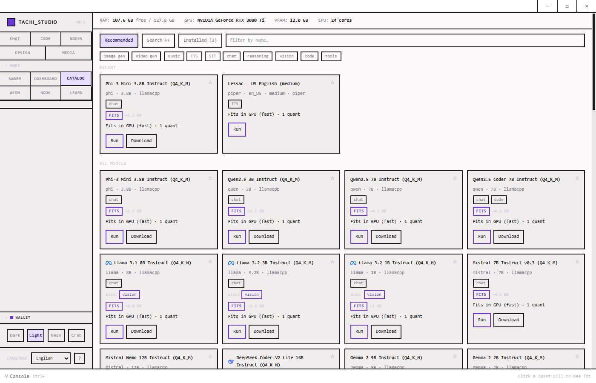

Conversations live in folders with their own system prompt and knowledge folder.
Full-text search across your whole history. Attach a folder and answers come back
with citation chips pointing at the file they came from. PDFs are read locally,
so they work with every provider — including the ones that cannot read PDFs.

The catalog above shows what your machine can actually run: it reads your GPU and
memory, then tells you whether a model **fits** before you spend twenty minutes
downloading it.

### Code — agents that work on your repo

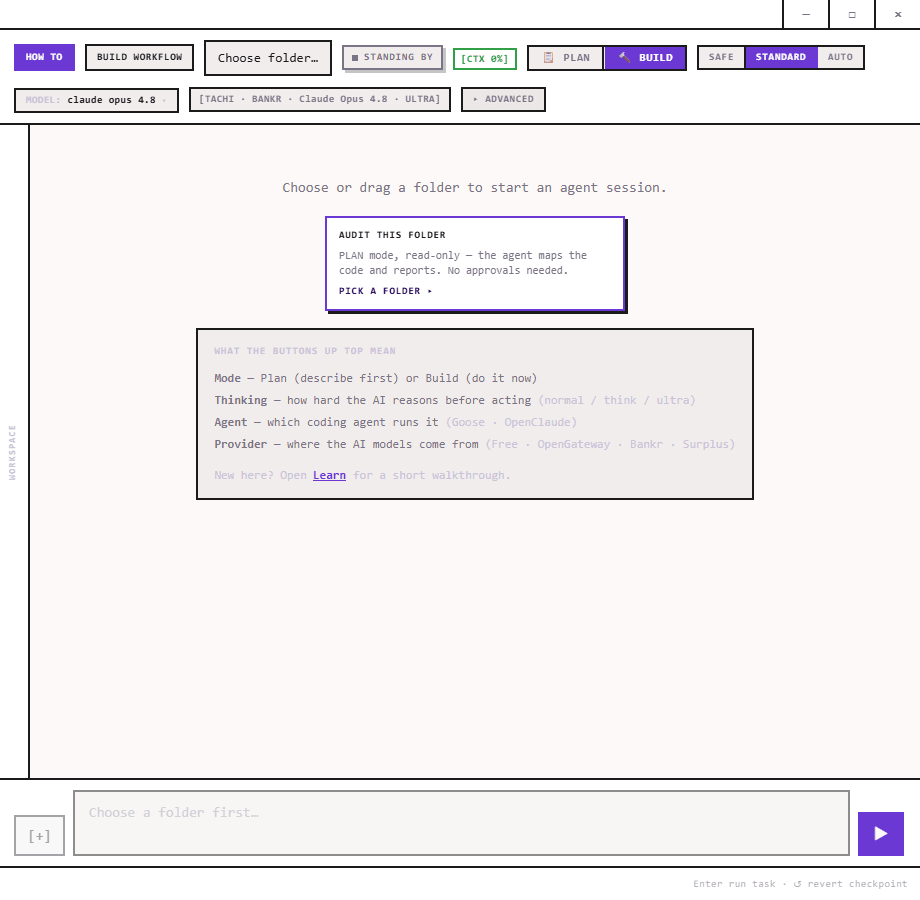

Choose a folder, choose an intent — *plan* (read-only, describe first) or *build*
(do it now) — and go. Four agent runtimes are supported, including a first-party
one, and every one of them runs behind the same gate: tool-by-tool permissions,
a path boundary, and a network policy. An agent that decides it is stuck says so
instead of reporting a cheerful "done".

### Nodes — build a pipeline without writing glue

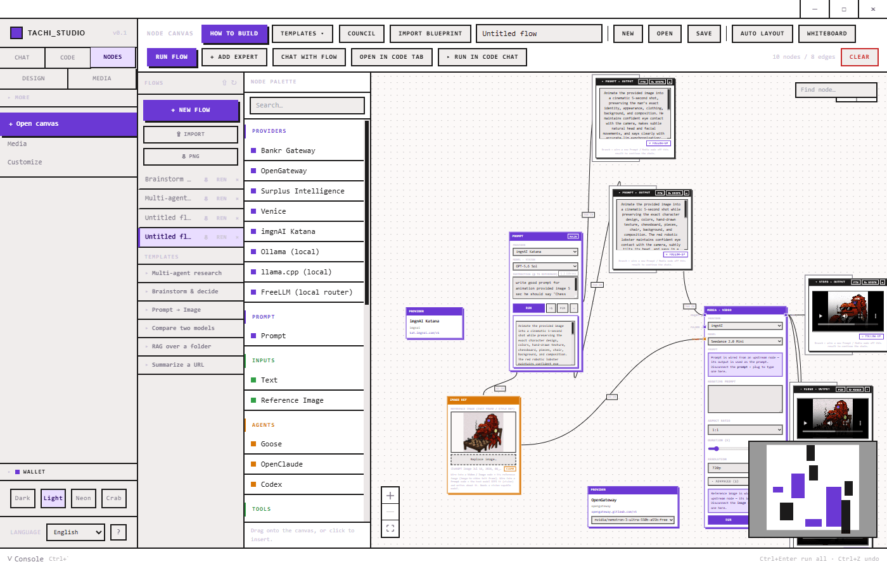

Providers, prompts, agents, images, video, webhooks and tools are blocks. Wire
them up, press **RUN FLOW**, and watch results fill in. Flows are plain files:
save one, send it to someone, import theirs. Start from a template if you would
rather not start from an empty board.

### Media — generate locally

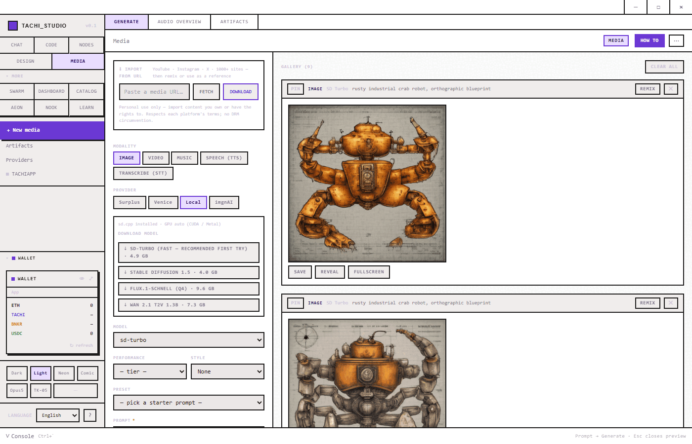

Image, video, music, speech and transcription. The local engines
(stable-diffusion.cpp, Piper, Whisper) download on request, are checked against
the publisher's own SHA256 before they run, and then work entirely offline on
your GPU. Import from a URL, remix a result, or send it to the canvas.

### Design — say what you want, get a real page

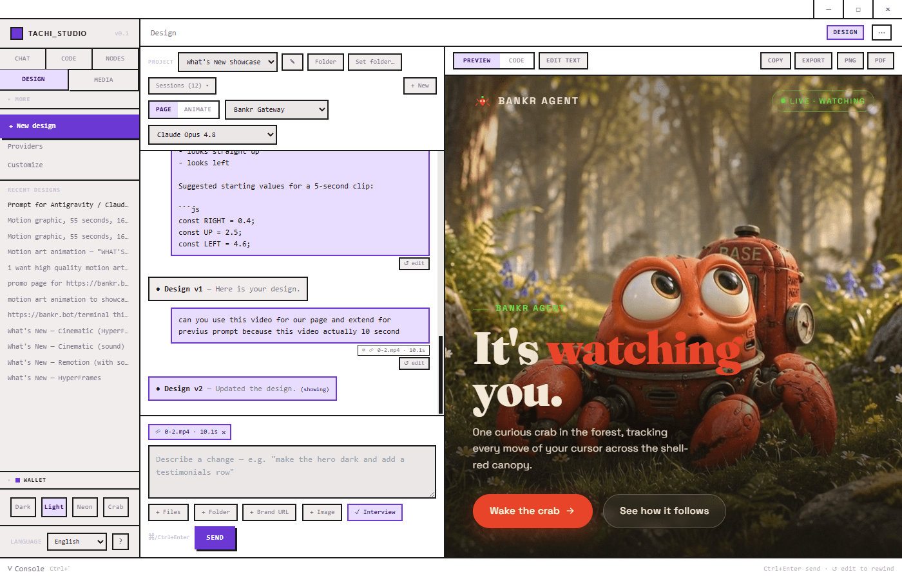

Describe a page or a motion graphic and edit it by pointing at what you want
changed. Export to HTML, PNG, PDF or MP4. Video export needs a one-time ~47 MB
encoder download, fetched from Remotion's official package on an explicit click —
it is not bundled, because that build of FFmpeg states its own licence forbids
redistribution.

### Dashboard — the truth about your machine

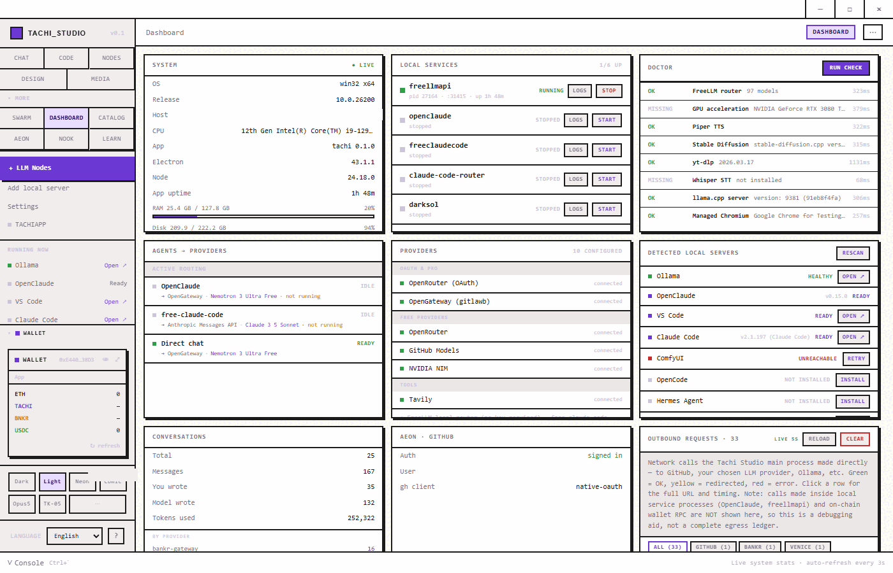

What is running, what it costs, what is installed and what is broken. The
**doctor** panel checks each part and reports what it found, not what it hopes.
Every outbound network request the app makes is listed, with the URL and timing —
so "local-first" is something you can audit instead of believe.

---

## Privacy, in specifics

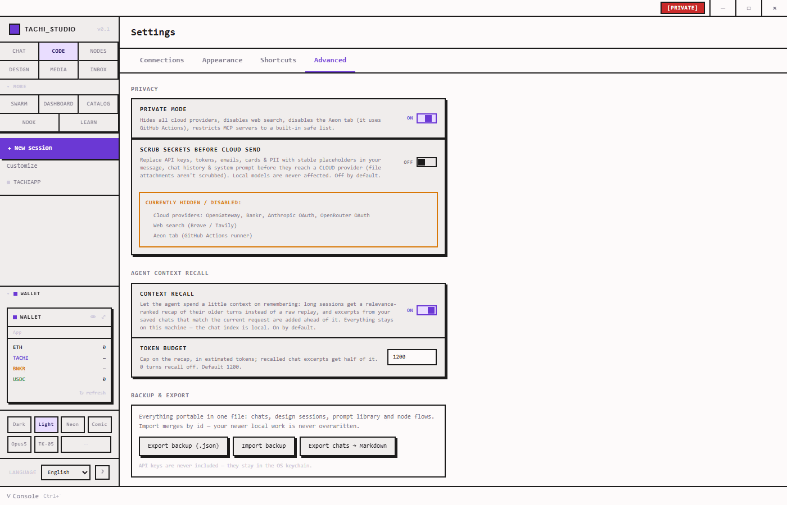

- **PRIVATE MODE** hides cloud providers, disables web search, and restricts MCP
  servers to a local safe list — enforced in the main process, where the network
  calls actually happen.
- **API keys** are encrypted by the OS keychain and never cross into the window
  that renders your chat.
- **Chats, flows and settings** are files on your disk. There is an export button
  and no account to delete.
- **Downloads are verified** against the publisher's own SHA256 digest, and a
  packaged build refuses to run any binary whose hash was not pinned at build time.
- **Wallet keys** (the optional on-chain features) live in the keychain, never
  cross IPC, and every transaction needs an explicit confirmation.

Security posture in full: [SECURITY.md](SECURITY.md).

---

## Make it yours

| | |
|---|---|
| 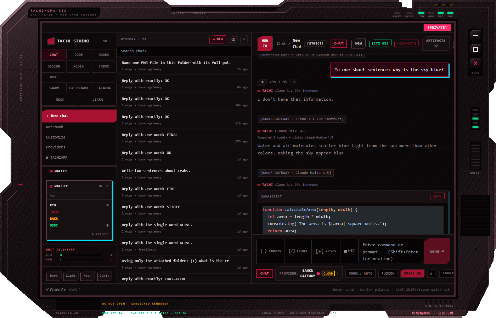 | 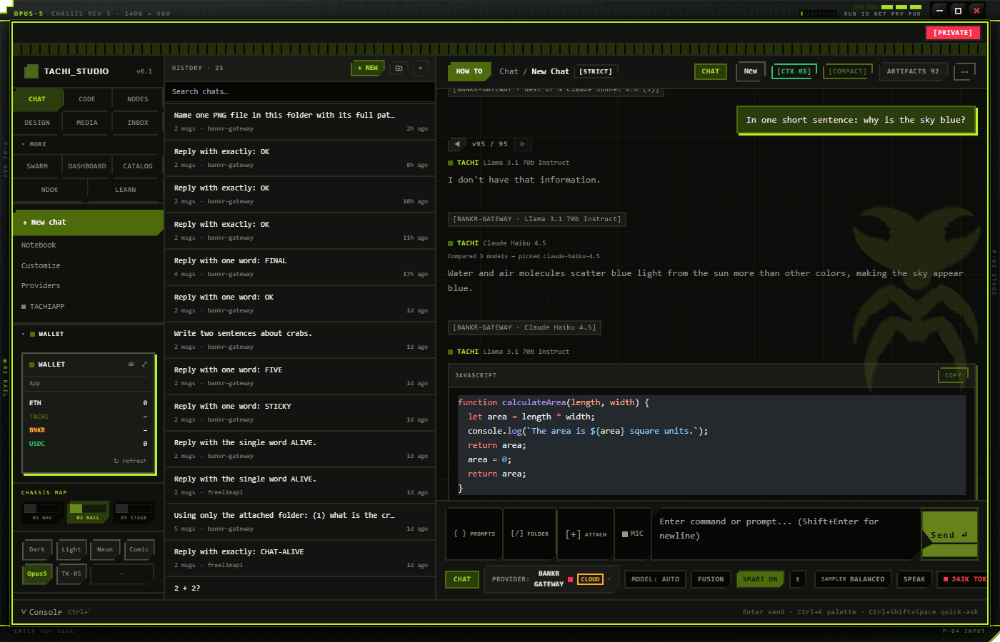 |

Themes go further than a colour swap — some of them redraw the window frame
itself, keys and all. Adding one is a CSS file and a registry entry:
[recipes/ADDING-A-THEME.md](recipes/ADDING-A-THEME.md).

---

## Build from source

Requires **Node 22+** and **pnpm 11+** on Windows, macOS or Linux.

```bash
git clone https://github.com/tachikomared/tachi-studio.git
cd tachi-studio
pnpm install
pnpm prepare:sidecars   # required once — builds the free-router sidecar
pnpm dev
```

`prepare:sidecars` is a separate step because it clones and builds a pinned
commit of a second project, including a native addon rebuild for Electron's ABI.
`pnpm dev` will not be fully working until it has run once.

You do not need an API key to start: the keyless providers route out of the box.
Add your own in **Settings → Connections**.

| Command | What it does |
|---|---|
| `pnpm dev` | Run the app in development |
| `pnpm build` | Build main, preload and renderer |
| `pnpm typecheck` | Whole-project `tsc --noEmit` |
| `pnpm test` | Unit suites — `@tachi/core` and desktop (~9 800 tests) |
| `pnpm -F tachi-studio-desktop package` | Build an installer for the current OS |

## Layout

```
apps/desktop/electron/   main process — IPC surfaces, services, MCP server
apps/desktop/src/        renderer — pages, Zustand stores, i18n
packages/core/           @tachi/core — shared types, routing, memory, parsers
scripts/                 sidecar preparation, licence notice generation
recipes/                 how to extend: themes, agent memory
docs/                    architecture and subsystem documentation
```

Start with [docs/architecture.md](docs/architecture.md).

## Contributing

Issues and pull requests are welcome — especially macOS and Linux reports, since
those are the platforms that need real users to become real releases. See
[CONTRIBUTING.md](CONTRIBUTING.md) and [CODE_OF_CONDUCT.md](CODE_OF_CONDUCT.md).

## Licence

MIT — see [LICENSE](LICENSE).

Tachi Studio stands on a lot of other people's work. Every production dependency
and its licence is listed in [THIRD_PARTY_NOTICES.md](THIRD_PARTY_NOTICES.md),
including the handful that are **not** MIT and what that means for you.

<div align="center">

**[⬇ Download](https://github.com/tachikomared/tachi-studio/releases/latest)** ·
[Documentation](docs/) ·
[Issues](https://github.com/tachikomared/tachi-studio/issues) ·
[Discussions](https://github.com/tachikomared/tachi-studio/discussions)

</div>
